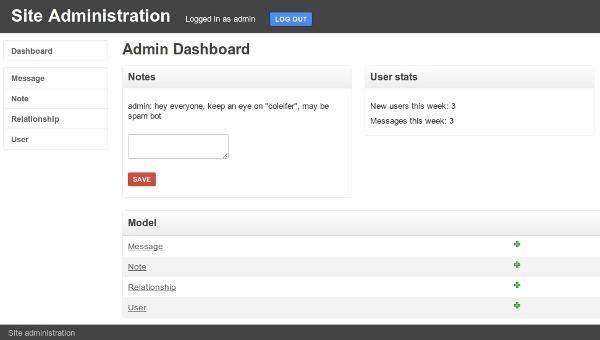
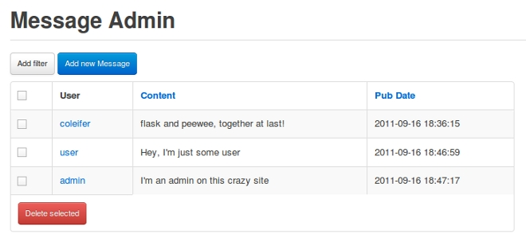
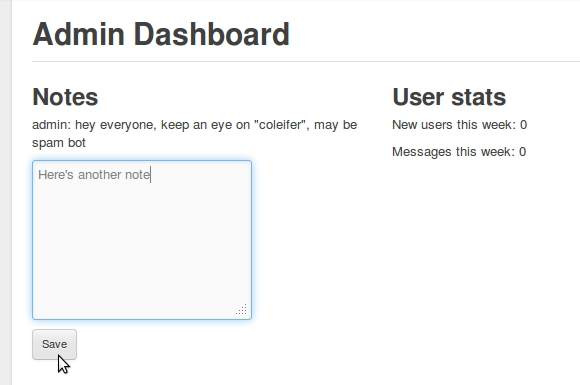
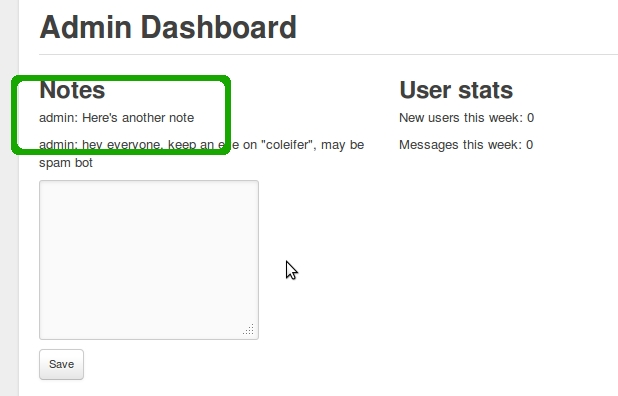

.. _admin-interface:

Admin Interface
===============

Many web applications ship with an "admin area", where priveleged users can
view and modify content.  By introspecting your application's models, flask-peewee
can provide you with straightforward, easily-extensible forms for managing your
application content.

Here's a screen-shot of the admin dashboard:

Getting started
---------------

To get started with the admin, there are just a couple steps:

1. Instantiate an :py:class:`Auth` backend for your project -- this component is responsible for providing the security for the admin area

    .. code-block:: python
    
        from flask import Flask
        
        from flask_peewee.auth import Auth
        from flask_peewee.db import Database
        
        app = Flask(__name__)
        db = Database(app)
        
        # needed for authentication
        auth = Auth(app, db)
        

2. Instantiate an :py:class:`Admin` object

    .. code-block:: python
    
        # continued from above...
        from flask_peewee.admin import Admin
        
        admin = Admin(app, auth)
        
3. Register any :py:class:`ModelAdmin` or :py:class:`AdminPanel` objects you would like to expose via the admin

    .. code-block:: python
    
        # continuing... assuming "Blog" and "Entry" models
        admin.register(Blog) # register "Blog" with vanilla ModelAdmin
        admin.register(Entry, EntryAdmin) # register "Entry" with a custom ModelAdmin subclass
        
        # assume we have an "AdminPanel" called "NotePanel"
        admin.register_panel('Notes', NotePanel)

4. Call :py:meth:`Admin.setup()`, which registers the admin blueprint and configures the urls

    .. code-block:: python
    
        # after all models and panels are registered, configure the urls
        admin.setup()

.. note::

    For a complete example, check the :ref:`example` which ships with the project.

Customizing how models are displayed
------------------------------------

We'll use the "Message" model taken from the `example app <https://github.com/coleifer/flask-peewee/tree/master/example>`_,
which looks like this:

.. code-block:: python

    class Message(db.Model):
        user = ForeignKeyField(User)
        content = TextField()
        pub_date = DateTimeField(default=datetime.datetime.now)
        
        def __unicode__(self):
            return '%s: %s' % (self.user, self.content)

If we were to simply register this model with the admin, it would look something
like this:

.. code-block:: python

    admin = Admin(app, auth)
    admin.register(Message)
    
    admin.setup()

.. image:: fp-message-admin.jpg

A quick way to improve the appearance of this view is to specify which columns
to display.  To start customizing how the ``Message`` model is displayed in the
admin, we'll subclass :py:class:`ModelAdmin`.

.. code-block:: python

    from flask_peewee.admin import ModelAdmin
    
    class MessageAdmin(ModelAdmin):
        columns = ('user', 'content', 'pub_date',)
    
    admin.register(Message, MessageAdmin)
    
    admin.setup()

Now the admin shows all the columns and they can be clicked to sort the data:

Suppose privacy is a big concern, and under no circumstances should a user be
able to see another user's messages -- even in the admin.  This can be done by overriding
the :py:meth:`~ModelAdmin.get_query` method:

.. code-block:: python

    def get_query(self):
        return self.model.filter(user=g.user)

Now a user will only be able to see and edit their own messages.

Creating admin panels
---------------------

:py:class:`AdminPanel` classes provide a way of extending the admin dashboard with arbitrary functionality.
These are displayed as "panels" on the admin dashboard with a customizable
template.  They may additionally, however, define any views and urls.  These
views will automatically be protected by the same authentication used throughout
the admin area.

Some example use-cases for AdminPanels might be:

* Display some at-a-glance functionality in the dashboard, like stats on new
  user signups.
* Provide a set of views that should only be visible to site administrators,
  for example a mailing-list app.
* Control global site settings, turn on and off features, etc.

Referring to the `example app <https://github.com/coleifer/flask-peewee/tree/master/example>`_,
we'll look at a simple panel that allows administrators to leave "notes" in the admin area:

Here's what the panel class looks like:

.. code-block:: python

    class NotePanel(AdminPanel):
        template_name = 'admin/notes.html'
        
        def get_urls(self):
            return (
                ('/create/', self.create),
            )
        
        def create(self):
            if request.method == 'POST':
                if request.form.get('message'):
                    Note.create(
                        user=auth.get_logged_in_user(),
                        message=request.form['message'],
                    )
            next = request.form.get('next') or self.dashboard_url()
            return redirect(next)
        
        def get_context(self):
            return {
                'note_list': Note.select().order_by(('created_date', 'desc')).paginate(1, 3)
            }

When the admin dashboard is rendered (``/admin/``), all panels are rendered using
the templates the specify.  The template is rendered with the context provided
by the panel's ``get_context`` method.

And the template:

.. code-block:: python

    

    
      
        
{{ note.user.username }}: {{ note.message }}

      
      <form method="post" action="{{ url_for(panel.get_url_name('create')) }}">
        <input type="hidden" value="{{ request.url }}" />
        
<textarea name="message"></textarea>

        
<button type="submit" class="btn small">Save</button>

      </form>
    

A panel can provide as many urls and views as you like.  These views will all be
protected by the same authentication as other parts of the admin area.

Handling File Uploads
---------------------

Flask and wtforms both provide support for handling file uploads (on the server
and generating form fields).  Peewee, however, does not have a "file field" --
generally I store a path to a file on disk and thus use a ``CharField`` for
the storage.

Here's a very simple example of a "photo" model and a ``ModelAdmin`` that enables
file uploads.

.. code-block:: models.py

    # models.py
    import datetime
    import os
    
    from flask import Markup
    from peewee import *
    from werkzeug import secure_filename
    
    from app import app, db
    
    
    class Photo(db.Model):
        image = CharField()
    
        def __unicode__(self):
            return self.image
    
        def save_image(self, file_obj):
            self.image = secure_filename(file_obj.filename)
            full_path = os.path.join(app.config['MEDIA_ROOT'], self.image)
            file_obj.save(full_path)
            self.save()
    
        def url(self):
            return os.path.join(app.config['MEDIA_URL'], self.image)
    
        def thumb(self):
            return Markup('' % self.url())

.. code-block:: python

    # admin.py
    from flask import request
    from flask_peewee.admin import Admin, ModelAdmin
    from wtforms.fields import FileField, HiddenField
    from wtforms.form import Form

    from app import app, db
    from auth import auth
    from models import Photo

    admin = Admin(app, auth)

    class PhotoAdmin(ModelAdmin):
        columns = ['image', 'thumb']

        def get_form(self):
            class PhotoForm(Form):
                image = HiddenField()
                image_file = FileField(u'Image file')

            return PhotoForm

        def save_model(self, instance, form, adding=False):
            instance = super(PhotoAdmin, self).save_model(instance, form, adding)
            if 'image_file' in request.files:
                file = request.files['image_file']
                instance.save_image(file)
            return instance

    admin.register(Photo, PhotoAdmin)
