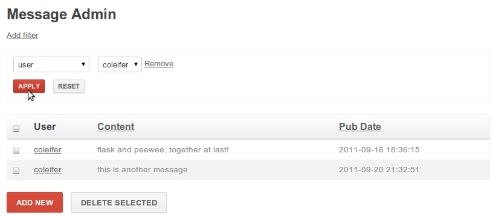
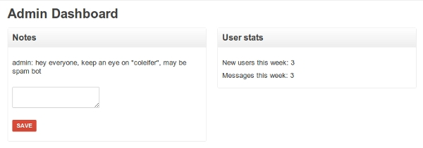

.. _admin-interface:

Admin Interface
===============

Many web applications ship with an "admin area", where priveleged users can
view and modify content.  By introspecting your application's models, flask-peewee
can provide you with straightforward, easily-extensible forms for managing your
application content.

Here's a screen-shot of the admin dashboard:

.. image:: fp-admin.jpg

Getting started
---------------

To get started with the admin, there are just a couple steps:

1. Instantiate an :py:class:`Auth` backend for your project -- this component is responsible for providing the security for the admin area

    .. code-block:: python
    
        from flask import Flask
        
        from flaskext.auth import Auth
        from flaskext.db import Database
        
        app = Flask(__name__)
        db = Database(app)
        
        # needed for authentication
        auth = Auth(app, db)
        

2. Instantiate an :py:class:`Admin` object

    .. code-block:: python
    
        # continued from above...
        from flaskext.admin import Admin
        
        admin = Admin(app, auth)
        
3. Register any :py:class:`ModelAdmin` or :py:class:`AdminPanel` objects you would like to expose via the admin

    .. code-block:: python
    
        # continuing... assuming "Blog" and "Entry" models
        admin.register(Blog) # register "Blog" with vanilla ModelAdmin
        admin.register(Entry, EntryAdmin) # register "Entry" with a custom ModelAdmin subclass
        
        # assume we have an "AdminPanel" called "NotePanel"
        admin.register_panel('Notes', NotePanel)

4. Call :py:meth:`Admin.setup()`, which registers the admin blueprint and configures the urls

    .. code-block:: python
    
        # after all models and panels are registered, configure the urls
        admin.setup()

.. note::

    for a complete example, check the :ref:`example` which ships with the project

Components of the Admin
-----------------------

The admin area is composed of three main components:

1. :py:class:`ModelAdmin` instances, which expose create/edit/delete functionality for peewee models
2. :py:class:`AdminPanel` instances, which appear in the dashboard and provide any additional functionality
3. :py:class:`Admin` which serves as a central registry for :py:class:`ModelAdmin` and :py:class:`AdminPanel` instances

ModelAdmin
^^^^^^^^^^

Screenshot showing a typical :py:class:`ModelAdmin` -- this one exposing ``Message``
objects.  Currently the list of messages is filtered to only list those by the
user "coleifer".

Typical usage:

.. code-block:: python

    admin = Admin(app, auth)

    class Message(db.Model):
        user = ForeignKeyField(User)
        content = TextField()
        pub_date = DateTimeField(default=datetime.datetime.now)
        
        def __unicode__(self):
            return '%s: %s' % (self.user, self.content)

    class MessageAdmin(ModelAdmin):
        columns = ('user', 'content', 'pub_date',)
    
    
    admin.register(Message, MessageAdmin)

.. py:class:: ModelAdmin

    Class that determines how a peewee ``Model`` is exposed in the admin area.  Provides
    a way of encapsulating model-specific configuration and behaviors.
    
    .. py:attribute:: columns
    
        What columns should be displayed in the list index.  By default if no
        columns are specified the ``Model``'s ``__unicode__()`` will be used.
        
        If a column is a model field, it will be "sortable".
        
        .. code-block:: python
        
            class EntryAdmin(ModelAdmin):
                columns = ['title', 'pub_date', 'blog']
        
        .. note:: columns can be either attributes of the model or callables on
            the model instance, though they will be called with no parameters.
    
    .. py:attribute:: paginate_by

        How many records to paginate by when viewing lists of models, defaults to 20

    .. py:method:: get_query()
    
        :rtype: A ``SelectQuery`` that represents the list of objects to expose
        
        Useful in the event that you would like to limit the objects shown via
        the admin.
        
        .. code-block:: python
        
            class UserAdmin(ModelAdmin):
                def get_query():
                    # ask the auth system for the currently logged-in user
                    current_user = self.auth.get_logged_in_user()
                    
                    # if they are not a superuser, only show them their own
                    # account in the admin
                    if not current_user.is_superuser:
                        return User.filter(id=current_user.id)
                    
                    # otherwise, show them all users
                    return User.select()

    .. py:method:: get_object(pk)
    
        :rtype: The model instance with the given pk, raising a ``DoesNotExist``
                in the event the model instance does not exist.

    .. py:method:: get_form()
    
        Provides a useful extension point in the event you want to define custom
        fields or custom validation behavior.
    
        :rtype: A `wtf-peewee <http://github.com/coleifer/wtf-peewee>`_ Form subclass that
                will be used when adding or editing model instances in the admin.
    
    .. py:method:: save_model(instance, form, adding=False)
        
        :param instance: an unsaved model instance
        :param form: a validated form instance
        :param adding: boolean to indicate whether we are adding a new instance
                or saving an existing
    
        Method responsible for persisting changes to the database.  Called by both
        the add and the edit views.  
        
        Here is an example from the default ``auth.User`` :py:class:`ModelAdmin`,
        in which the password is displayed as a sha1, but if the user is adding
        or edits the existing password, it re-hashes:
        
        .. code-block:: python
        
            def save_model(self, instance, form, adding=False):
                orig_password = instance.password
                
                user = super(UserAdmin, self).save_model(instance, form, adding)
                
                if orig_password != form.password.data:
                    user.set_password(form.password.data)
                    user.save()
                
                return user
        
    .. py:method:: get_urls()
    
        Useful as a hook for extending :py:class:`ModelAdmin` functionality
        with additional urls.
    
        :rtype: tuple of 2-tuples consisting of a mapping between url and view
    
    .. py:method:: get_url_name(name)
    
        Since urls are namespaced, this function provides an easy way to get
        full urls to views provided by this ModelAdmin

AdminPanel
^^^^^^^^^^

Screenshot showing some examples of :py:class:`AdminPanel` instances.  One of
these exposes a form where administrators can post "notes", the other showing
some aggregate data on user signups and site activity:

Typical usage:

.. code-block:: python

    # panel code
    
    class NotePanel(AdminPanel):
        template_name = 'admin/notes.html'
        
        def get_urls(self):
            return (
                ('/create/', self.create),
            )
        
        def create(self):
            if request.method == 'POST':
                if request.form.get('message'):
                    Note.create(
                        user=auth.get_logged_in_user(),
                        message=request.form['message'],
                    )
            next = request.form.get('next') or self.dashboard_url()
            return redirect(next)
        
        def get_context(self):
            return {
                'note_list': Note.select().order_by(('created_date', 'desc')).paginate(1, 3)
            }
    
    admin.register_panel('Notes', NotePanel)

.. code-block:: html

    <!-- template code -->
    

    
      
        
{{ note.user.username }}: {{ note.message }}

      
      <form method="post" action="{{ url_for(panel.get_url_name('create')) }}">
        <input type="hidden" value="{{ request.url }}" />
        
<textarea name="message"></textarea>

        
<button type="submit" class="small">Save</button>

      </form>
    

.. py:class:: AdminPanel

    Class that provides a simple interface for providing arbitrary extensions to
    the admin.  These are displayed as "panels" on the admin dashboard with a customizable
    template.  They may additionally, however, define any views and urls.
    
    .. py:attribute:: template_name
    
        What template to use to render the panel in the admin dashboard, defaults
        to ``'admin/panels/default.html'``.
    
    .. py:method:: get_urls()
    
        Mapping of urls and views that are provided by this panel.
    
        :rtype: Returns a tuple of 2-tuples mapping url to view
    
    .. py:method:: get_url_name(name)
    
        Since urls are namespaced, this function provides an easy way to get
        full urls to views provided by this panel
    
        :param name: string representation of the view function whose url you want
        :rtype: String representing url
        
        .. code-block:: html
        
            <!-- taken from example -->
            <!-- will return something like /admin/notes/create/ -->
            {{ url_for(panel.get_url_name('create')) }}
    
    .. py:method:: get_template_name()
    
        Return the template used to render this panel in the dashboard.  By default
        simply returns the template stored under :py:attr:`AdminPanel.template_name`.
    
    .. py:method:: get_context()
    
        Return the context to be used when rendering the dashboard template.
        
        :rtype: Dictionary
    
    .. py:method:: render()
    
        Render the panel template with the context -- this is what gets displayed
        in the admin dashboard.

The Admin Class
^^^^^^^^^^^^^^^

.. py:class:: Admin

    Class used to expose an admin area at a certain url in your application.

    .. py:method:: __init__(app, auth[, blueprint_factory[, template_helper[, prefix]]])
        
        :param app: flask application to bind admin to
        :param auth: :py:class:`Auth` instance which will provide authentication
        :param blueprint_factory: an object that will create the ``BluePrint`` used by the admin
        :param template_helper: a subclass of :py:class:`AdminTemplateHelper` that provides helpers
            and context to used by the admin templates
        :param prefix: url to bind admin to, defaults to ``/admin``

    .. py:method:: register(model[, admin_class=ModelAdmin])
    
        :param model: peewee model to expose via the admin
        :param admin_class: :py:class:`ModelAdmin` or subclass to use with given model
    
    .. py:method:: register_panel(title, panel)
    
        :param title: identifier for panel, example might be "Site Stats"
        :param panel: subclass of :py:class:`AdminPanel` to display

    .. py:method:: setup()
    
        Configures urls for models and panels, then registers blueprint.
        
        .. warning::
            call this **after** registering your models and panels
    
    .. py:method:: check_user_permission(user)
    
        :param user: the currently logged-in user, exposed by the :py:class:`Auth` instance
    
        Check whether the given user has permission to access to the admin area.  The
        default implementation simply checks whether the ``admin`` field is checked.
        
        .. code-block:: python
        
            def check_user_permission(self, user):
                return user.admin
    
        :rtype: Boolean
    
    .. py:method:: get_urls()
    
        Get a tuple of 2-tuples mapping urls to view functions that will be
        exposed by the admin.  The default implementation looks like this:
        
        .. code-block:: python
        
            def get_urls(self):
                return (
                    ('/', self.auth_required(self.index)),
                )
