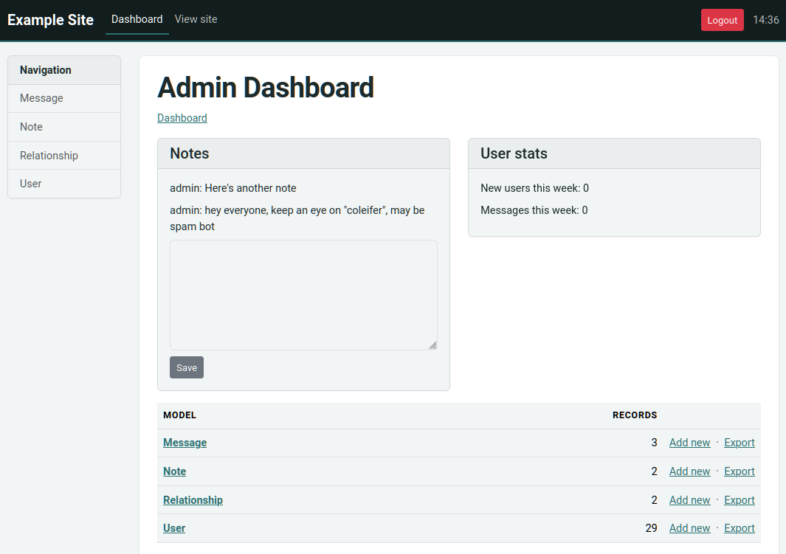
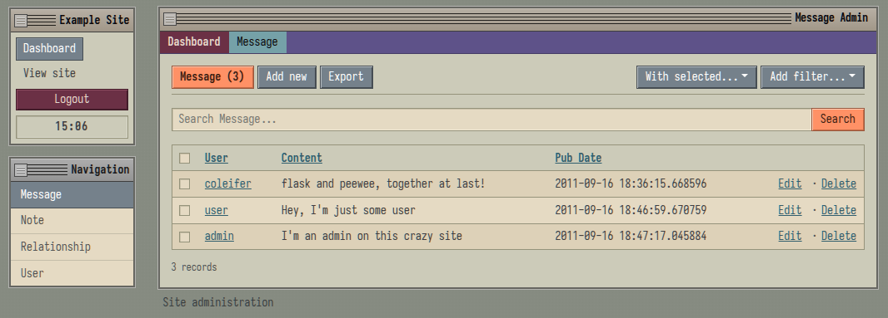
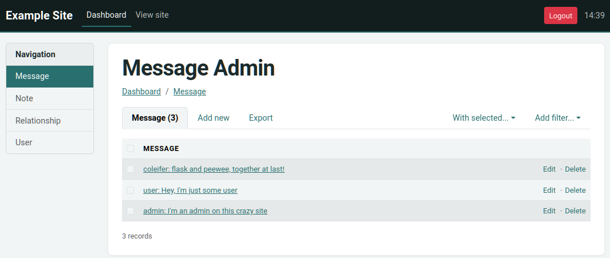
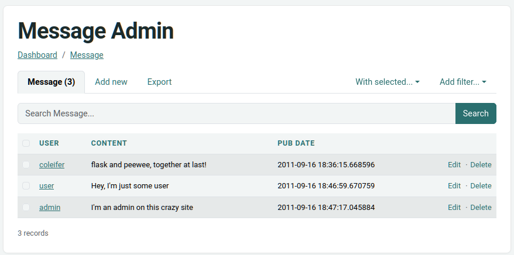
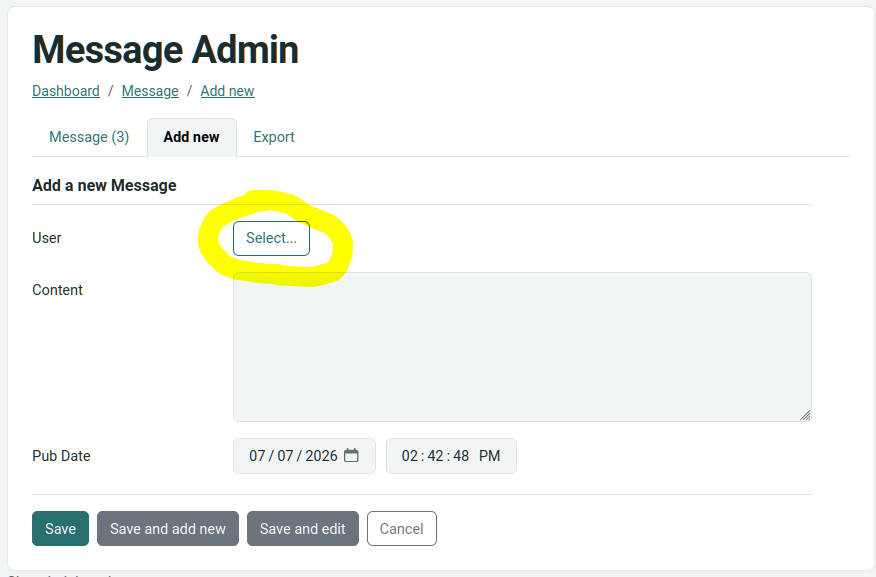
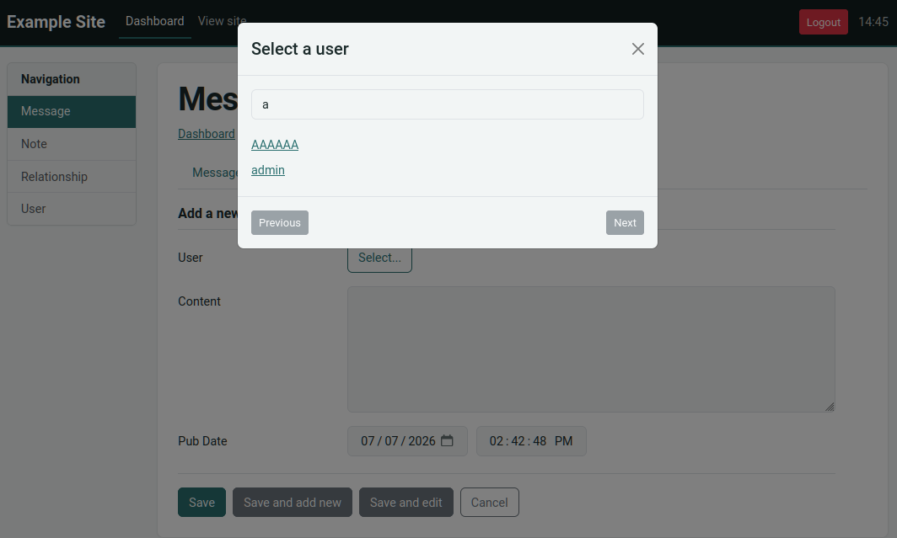
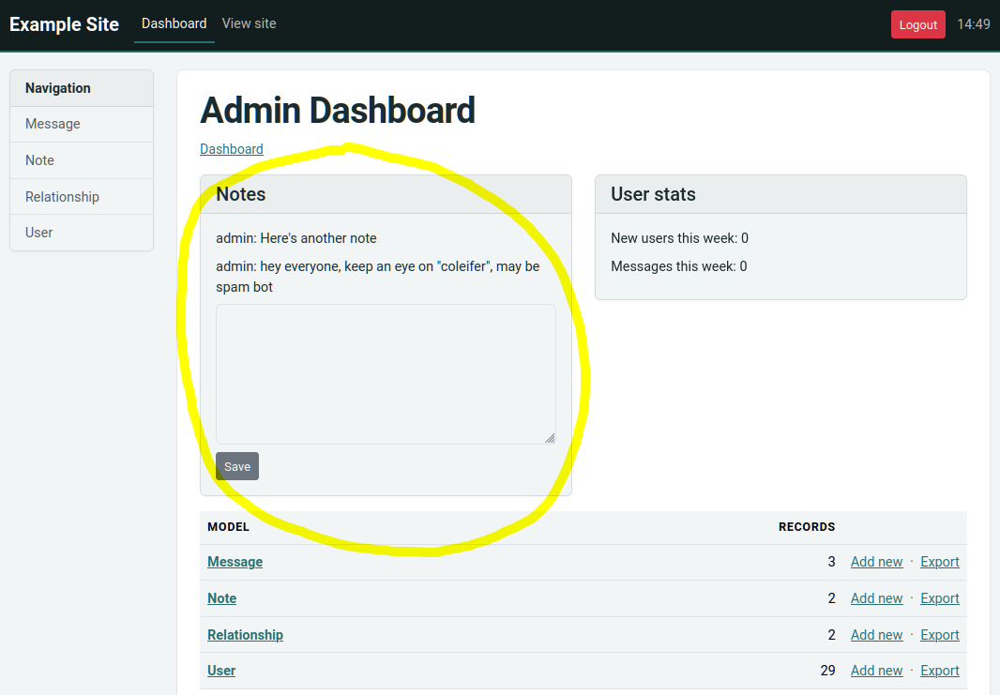

.. _admin-interface:

Admin Interface
===============

Many web applications ship with an "admin area", where priveleged users can
view and modify content.  By introspecting your application's models, flask-peewee
can provide you with straightforward, easily-extensible forms for managing your
application content.

Here's a screen-shot of the admin dashboard:

You can also try out a custom theme. Here is the *crux* theme:

Getting started
---------------

To get started with the admin, there are just a couple steps:

1. Instantiate an :py:class:`Auth` backend for your project -- this component
   is responsible for providing the security for the admin area

    .. code-block:: python

        from flask import Flask

        from flask_peewee.auth import Auth
        from flask_peewee.db import Database

        app = Flask(__name__)
        db = Database(app)

        # needed for authentication
        auth = Auth(app, db)

2. Instantiate an :py:class:`Admin` object

    .. code-block:: python

        # continued from above...
        from flask_peewee.admin import Admin

        admin = Admin(app, auth)

3. Register any :py:class:`ModelAdmin` or :py:class:`AdminPanel` objects you
   would like to expose via the admin

    .. code-block:: python

        # continuing... assuming "Blog" and "Entry" models
        admin.register(Blog) # register "Blog" with vanilla ModelAdmin
        admin.register(Entry, EntryAdmin) # register "Entry" with a custom ModelAdmin subclass

        # assume we have an "AdminPanel" called "NotePanel"
        admin.register_panel('Notes', NotePanel)

4. Call :py:meth:`Admin.setup()`, which registers the admin blueprint and configures the urls

    .. code-block:: python

        # after all models and panels are registered, configure the urls
        admin.setup()

.. note::

    For a complete example, check the `example app
    <https://github.com/coleifer/flask-peewee/tree/master/example>`_ which ships
    with the project.

Customizing how models are displayed
------------------------------------

We'll use the "Message" model taken from the `example app <https://github.com/coleifer/flask-peewee/tree/master/example>`_,
which looks like this:

.. code-block:: python

    class Message(db.Model):
        user = ForeignKeyField(User)
        content = TextField()
        pub_date = DateTimeField(default=datetime.datetime.now)

        def __str__(self):
            return '%s: %s' % (self.user, self.content)

If we were to simply register this model with the admin, it would look something
like this:

.. code-block:: python

    admin = Admin(app, auth)
    admin.register(Message)

    admin.setup()

A quick way to improve the appearance of this view is to specify which columns
to display.  To start customizing how the ``Message`` model is displayed in the
admin, we'll subclass :py:class:`ModelAdmin`.

.. code-block:: python

    from flask_peewee.admin import ModelAdmin

    class MessageAdmin(ModelAdmin):
        columns = ('user', 'content', 'pub_date',)
        foreign_key_lookups = {'user': 'username'}
        filter_fields = ('user', 'content', 'pub_date', 'user__username')
        search_fields = ('content', 'user__username')

    admin.register(Message, MessageAdmin)

    admin.setup()

Now the admin shows all the columns and they can be clicked to sort the data.
Filtering is available, as is search:

Searching
^^^^^^^^^

Set ``search_fields`` to add a quick-search box above the list.  It runs a
case-insensitive substring match over char/text fields and supports ``__``
traversal into related models, so ``('content', 'user__username')`` searches
both the message body and the author's username, joining ``User`` automatically:

.. code-block:: python

    class MessageAdmin(ModelAdmin):
        columns = ('user', 'content', 'pub_date',)
        search_fields = ('content', 'user__username')

Leaving ``search_fields`` empty (the default) hides the search box entirely.

Filtering
^^^^^^^^^

The list and export views expose per-field filters (equals, less-than, contains,
etc., chosen by field type).  By default every field is filterable; two
attributes narrow that:

* ``filter_fields`` -- a whitelist of the only fields that may be filtered
* ``filter_exclude`` -- a blacklist of fields to hide from filtering

Both accept ``__`` notation for related fields, so
``filter_exclude = ('user__password',)`` keeps a sensitive related column out of
the filter UI entirely.

Restricting the queryset
^^^^^^^^^^^^^^^^^^^^^^^^^

Suppose privacy is a big concern, and under no circumstances should a user be
able to see another user's messages -- even in the admin.  This can be done by overriding
the :py:meth:`~ModelAdmin.get_query` method:

.. code-block:: python

    def get_query(self):
        return self.model.select().where(self.model.user == g.user)

Now a user will only be able to see and edit their own messages.

Overriding Admin Templates
^^^^^^^^^^^^^^^^^^^^^^^^^^

Use the :py:meth:`ModelAdmin.get_template_overrides` method to override templates
for an individual ``Model``:

.. code-block:: python

    class MessageAdmin(ModelAdmin):
        # ...

        def get_template_overrides(self):
            # override the edit template with a custom one
            return {'edit': 'messages/admin/edit.html'}

    admin.register(Message, MessageAdmin)

This instructs the admin to use a custom template for the edit page in the Message
admin.  That template is stored in the application's templates.  It might look
something like this:

.. code-block:: jinja

     {# override the default edit template #}

    {# override any blocks here #}

There are five templates that can be overridden:

* index
* add
* edit
* delete
* export

Nicer display for Foreign Key fields
------------------------------------

By default a foreign key renders as a ``<select>`` of the related rows.  How that
holds up when the related table is large depends on where it appears:

* In **filters**, the ``<select>`` is automatically capped at the first 20 rows
  (plus whichever row is currently selected), so the page never balloons, but
  only those 20 rows are reachable.
* In **model forms** (add/edit), the ``<select>`` is *not* capped: every related
  row is rendered, which is slow to load and hammers the database on a large
  table.

To handle large related tables, set ``foreign_key_lookups`` -- a mapping of the
foreign-key field name to the related field to search and display on.  This
replaces the plain ``<select>`` with a paginated, type-ahead search backed by the
model admin's ``ajax_list`` endpoint (matching ``<field> LIKE '%query%'``, a page
at a time), so any row is reachable no matter how large the table:

.. code-block:: python

    class MessageAdmin(ModelAdmin):
        columns = ('user', 'content', 'pub_date',)
        foreign_key_lookups = {'user': 'username'}

The widget differs between the two contexts:

Filters
^^^^^^^

Without ``foreign_key_lookups`` the ``user`` filter is a ``<select>`` of the
first 20 users, fine for a small table, but on a large one you can only filter
by those first 20.  With it, the ``<select>`` gains an inline type-ahead search
that repopulates its options from ``ajax_list`` as you type, so any user can be
selected.

Model forms
^^^^^^^^^^^

Without ``foreign_key_lookups`` an add or edit form renders every related row in a
single ``<select>``, the case worth avoiding on a large table.  With it, the
field becomes a button showing the current selection; clicking it opens a modal
with a paginated, type-ahead list:

Bulk actions
------------

Every row in the list view has a checkbox, and the **"With selected..."**
dropdown offers *Export* and *Delete* out-of-the-box.  You can add your own
bulk operations by subclassing :py:class:`Action` and listing instances in your
:py:class:`ModelAdmin`'s ``actions`` attribute.

An action implements a single ``callback(self, id_list)`` method, which receives
the list of primary keys the user checked.  Suppose our ``Message`` model has a
``flagged`` boolean and we want a one-click way to flag the selected rows:

.. code-block:: python

    from flask_peewee.admin import Action, ModelAdmin

    class FlagAction(Action):
        def callback(self, id_list):
            Message.update(flagged=True).where(Message.id << id_list).execute()

    class MessageAdmin(ModelAdmin):
        columns = ('user', 'content', 'pub_date', 'flagged',)
        actions = [FlagAction()]

    admin.register(Message, MessageAdmin)

The action shows up in the "With selected..." dropdown labeled with its
``name``, which defaults to the class name minus the "Action" suffix
(``FlagAction`` becomes "Flag").  Pass ``name`` (and optionally ``description``)
to the constructor to override it, e.g. ``FlagAction(name='Flag as spam')``.

If a callback returns a Flask ``Response``, it is sent to the user as-is, handy
for generating a download from the selected rows:

.. code-block:: python

    from flask import Response

    class ExportContentAction(Action):
        def callback(self, id_list):
            rows = Message.select().where(Message.id << id_list)
            body = '\n'.join(msg.content for msg in rows)
            return Response(body, mimetype='text/plain', headers={
                'Content-Disposition': 'attachment; filename=messages.txt'})

If the callback returns anything else, the user is redirected back to the list
view.  Submitting an action with no rows selected flashes a warning and
does nothing.

Exporting data
--------------

Every registered model gets an **Export** view (also reachable from the list
view's "With selected..." dropdown).  It lets you choose which fields to include
-- across foreign keys, too -- and downloads the result as a JSON file, honoring
whatever filters are currently applied.

By default every field is exportable.  Two :py:class:`ModelAdmin` attributes
restrict that:

* ``export_fields`` -- a whitelist of field names that may be exported
* ``export_exclude`` -- a blacklist of field names to withhold

.. code-block:: python

    class UserAdmin(ModelAdmin):
        columns = ('username', 'email',)
        export_exclude = ('password',)   # never allow the password hash out

These restrictions are enforced **server-side**: hand-posting a withheld field
name will not dump it, so ``export_exclude = ('password',)`` is a real guarantee
rather than a merely-hidden checkbox.

Related fields are exported nested under their foreign key.  A related model
defers to *its own* registered :py:class:`ModelAdmin`'s
``export_fields``/``export_exclude``, so once ``UserAdmin`` excludes ``password``
above, no other model's export can reach ``user__password`` either.  Exporting,
say, the ``user``, ``content`` and ``user__username`` fields of ``Message``
produces:

.. code-block:: json

    [
      {"user": {"username": "admin"}, "content": "hello"},
      {"user": {"username": "coleifer"}, "content": "flask + peewee"}
    ]

.. note::
    Because related data nests under its foreign key, that foreign key is
    included automatically.  There is no way to nest a related field without it.

Creating admin panels
---------------------

:py:class:`AdminPanel` classes provide a way of extending the admin dashboard with arbitrary functionality.
These are displayed as "panels" on the admin dashboard with a customizable
template.  They may additionally, however, define any views and urls.  These
views will automatically be protected by the same authentication used throughout
the admin area.

Some example use-cases for AdminPanels might be:

* Display some at-a-glance functionality in the dashboard, like stats on new
  user signups.
* Provide a set of views that should only be visible to site administrators,
  for example a mailing-list app.
* Control global site settings, turn on and off features, etc.

Referring to the `example app <https://github.com/coleifer/flask-peewee/tree/master/example>`_,
we'll look at a simple panel that allows administrators to leave "notes" in the admin area:

Here's what the panel class looks like:

.. code-block:: python

    class NotePanel(AdminPanel):
        template_name = 'admin/notes.html'

        def get_urls(self):
            return (
                ('/create/', self.create),
            )

        def create(self):
            if request.method == 'POST':
                if request.form.get('message'):
                    Note.create(
                        user=auth.get_logged_in_user(),
                        message=request.form['message'])

            next = request.form.get('next') or self.dashboard_url()
            return redirect(next)

        def get_context(self):
            # Get the 3 latest notes.
            notes = Note.select().order_by(Note.created_date.desc()).paginate(1, 3)
            return {'note_list': notes}

When the admin dashboard is rendered (``/admin/``), all panels are rendered using
the templates the specify.  The template is rendered with the context provided
by the panel's ``get_context`` method.

And the template:

.. code-block:: jinja

    

    
      
        
{{ note.user.username }}: {{ note.message }}

      
      <form method="post" action="{{ url_for(panel.get_url_name('create')) }}">
        <input type="hidden" value="{{ request.url }}" />
        
<textarea name="message" class="form-control"></textarea>

        <button type="submit" class="btn btn-secondary btn-sm">Save</button>
      </form>
    

A panel can provide as many urls and views as you like.  These views will all be
protected by the same authentication as other parts of the admin area.

Handling File Uploads
---------------------

Flask and wtforms both provide support for handling file uploads (on the server
and generating form fields).  Peewee, however, does not have a "file field" --
generally I store a path to a file on disk and thus use a ``CharField`` for
the storage.

Here's a very simple example of a "photo" model and a ``ModelAdmin`` that enables
file uploads.

.. code-block:: python

    # models.py
    import datetime
    import os

    from markupsafe import Markup
    from peewee import *
    from werkzeug.utils import secure_filename

    from app import app, db

    class Photo(db.Model):
        image = CharField()

        def __str__(self):
            return self.image

        def save_image(self, file_obj):
            self.image = secure_filename(file_obj.filename)
            full_path = os.path.join(app.config['MEDIA_ROOT'], self.image)
            file_obj.save(full_path)
            self.save()

        def url(self):
            return os.path.join(app.config['MEDIA_URL'], self.image)

        def thumb(self):
            return Markup('' % self.url())

.. code-block:: python

    # admin.py
    from flask import request
    from flask_peewee.admin import Admin, ModelAdmin
    from wtforms.fields import FileField, HiddenField
    from wtforms.form import Form

    from app import app, db
    from auth import auth
    from models import Photo

    admin = Admin(app, auth)

    class PhotoAdmin(ModelAdmin):
        columns = ['image', 'thumb']

        def get_form(self, adding=False):
            class PhotoForm(Form):
                image = HiddenField()
                image_file = FileField('Image file')

            return PhotoForm

        def save_model(self, instance, form, adding=False):
            instance = super(PhotoAdmin, self).save_model(instance, form, adding)
            if 'image_file' in request.files:
                file = request.files['image_file']
                instance.save_image(file)
            return instance

    admin.register(Photo, PhotoAdmin)
