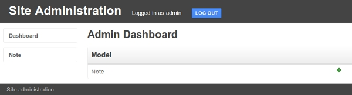
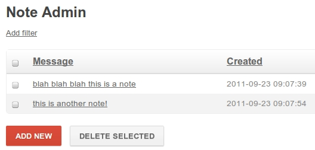

.. _getting-started:

Getting Started
===============

The goal of this document is to help get you up and running quickly.  So without
further ado, let's get started.

.. note::
    Hopefully you have some familiarity with the `flask framework <http://flask.pocoo.org/>`_ and
    the `peewee orm <https://peewee.readthedocs.io/>`_, but if not those links
    should help you get started.

.. note::
    For a complete example project, check the `example app <https://github.com/coleifer/flask-peewee/tree/master/example>`_
    that ships with flask-peewee.

Creating a flask app
--------------------

First, be sure you have :ref:`installed flask-peewee and its dependencies <installation>`.
You can verify by running the test suite: ``python setup.py test``.

After ensuring things are installed, open a new file called "app.py" and enter the
following code:

.. code-block:: python

    from flask import Flask

    app = Flask(__name__)
    app.config.from_object(__name__)

    if __name__ == '__main__':
        app.run()

This isn't very exciting, but we can check out our project by running the app:

.. code-block:: console

    $ python app.py
     * Running on http://127.0.0.1:5000/
     * Restarting with reloader

Navigating to the url listed will show a simple 404 page, because we haven't
configured any templates or views yet.

Creating a simple model
-----------------------

Let's add a simple model.  Before we can do that, though, it is necessary to
initialize the peewee database wrapper and configure the database:

.. code-block:: python

    from flask import Flask

    # flask-peewee bindings
    from flask_peewee.db import Database

    # configure our database
    DATABASE = {
        'name': 'example.db',
        'engine': 'peewee.SqliteDatabase',
    }
    DEBUG = True
    SECRET_KEY = 'ssshhhh'

    app = Flask(__name__)
    app.config.from_object(__name__)

    # instantiate the db wrapper
    db = Database(app)

    if __name__ == '__main__':
        app.run()

What this does is provides us with request handlers which connect to the database
on each request and close it when the request is finished.  It also provides a
base model class which is configured to work with the database specified in the
configuration.

Now we can create a model:

.. code-block:: python

    import datetime
    from peewee import *

    class Note(db.Model):
        message = TextField()
        created = DateTimeField(default=datetime.datetime.now)

.. note::
    The model we created, ``Note``, subclasses ``db.Model``, which in turn is a subclass
    of ``peewee.Model`` that is pre-configured to talk to our database.

Setting up a simple base template
---------------------------------

We'll need a simple template to serve as the base template for our app, so create
a folder named ``templates``.  In the ``templates`` folder create a file ``base.html``
and add the following:

.. code-block:: html

    <!doctype html>
    <html>
    <title>Test site</title>
    <body>
      <h2></h2>
      
    </body>
    </html>

Adding users to the site
------------------------

Before we can edit these ``Note`` models in the admin, we'll need to have some
way of authenticating users on the site.  This is where :py:class:`Auth` comes in.
:py:class:`Auth` provides a ``User`` model and views for logging in and logging out,
among other things, and is required by the :py:class:`Admin`.

.. code-block:: python

    from flask_peewee.auth import Auth

    # create an Auth object for use with our flask app and database wrapper
    auth = Auth(app, db)

Let's also modify the code that runs our app to ensure our tables get created
if need be:

.. code-block:: python

    if __name__ == '__main__':
        auth.User.create_table(fail_silently=True)
        Note.create_table(fail_silently=True)

        app.run()

After cleaning up the imports and declarations, we have something like the following:

.. code-block:: python

    import datetime
    from flask import Flask
    from flask_peewee.auth import Auth
    from flask_peewee.db import Database
    from peewee import *

    # configure our database
    DATABASE = {
        'name': 'example.db',
        'engine': 'peewee.SqliteDatabase',
    }
    DEBUG = True
    SECRET_KEY = 'ssshhhh'

    app = Flask(__name__)
    app.config.from_object(__name__)

    # instantiate the db wrapper
    db = Database(app)

    class Note(db.Model):
        message = TextField()
        created = DateTimeField(default=datetime.datetime.now)

    # create an Auth object for use with our flask app and database wrapper
    auth = Auth(app, db)

    if __name__ == '__main__':
        auth.User.create_table(fail_silently=True)
        Note.create_table(fail_silently=True)

        app.run()

Managing content using the admin area
-------------------------------------

**Now** we're ready to add the admin.  Place the following lines of code after
the initialization of the ``Auth`` class:

.. code-block:: python

    from flask_peewee.admin import Admin

    admin = Admin(app, auth)
    admin.register(Note)

    admin.setup()

We now have a functioning admin site!  Of course, we'll need a user log in with,
so open up an interactive python shell in the directory alongside the app and run
the following:

.. code-block:: python

    from app import auth
    auth.User.create_table(fail_silently=True)  # make sure table created.
    admin = auth.User(username='admin', email='', admin=True, active=True)
    admin.set_password('admin')
    admin.save()

It should now be possible to:

1. navigate to http://127.0.0.1:5000/admin/
2. enter in the username and password ("admin", "admin")
3. be redirected to the admin dashboard

The dashboard is pretty empty right now.  Go ahead and add a few notes (http://127.0.0.1:5000/admin/note/).  If you navigate now to the note
modeladmin you will see something like this:

.. image:: fp-note-admin.jpg

This is pretty lousy so let's clean it up to display the message and when it was
published.  We can do that by customizing the columns displayed.  Edit the app with
the following changes:

.. code-block:: python

    from flask_peewee.admin import Admin, ModelAdmin

    class NoteAdmin(ModelAdmin):
        columns = ('message', 'created',)

    admin = Admin(app, auth)

    admin.register(Note, NoteAdmin)

    admin.setup()

Now our modeladmin should look more like this:

Let's go ahead and add the ``auth.User`` model to the admin as well:

.. code-block:: python

    admin.register(Note, NoteAdmin)
    auth.register_admin(admin)

    admin.setup()

Exposing content using a REST API
---------------------------------

Adding a REST API is very similar to how we added the :py:class:`Admin` interface.
We will create a :py:class:`RestAPI` object, and then register our project's models
with it.  If we want to customize things, we can subclass :py:class:`RestResource`.

The first step, then, is to create the :py:class:`RestAPI` object:

.. code-block:: python

    from flask_peewee.rest import RestAPI

    # create a RestAPI container
    api = RestAPI(app)

    api.setup()

This doesn't do anything yet, we need to register models with it first.  Let's
register the ``Note`` model from earlier:

.. code-block:: python

    # create a RestAPI container
    api = RestAPI(app)

    # register the Note model
    api.register(Note)

    api.setup()

Assuming your project is still running, try executing the following command (or
just browse to the url listed):

.. code-block:: console

    $ curl http://127.0.0.1:5000/api/note/

You should see something like the following:

.. code-block:: javascript

    {
      "meta": {
        "model": "note",
        "next": "",
        "page": 1,
        "previous": ""
      },
      "objects": [
        {
          "message": "blah blah blah this is a note",
          "id": 1,
          "created": "2011-09-23 09:07:39"
        },
        {
          "message": "this is another note!",
          "id": 2,
          "created": "2011-09-23 09:07:54"
        }
      ]
    }

Suppose we want it to also be possible for registered users to be able to POST
messages using the API.  If you try and make a POST right now, you will get a
``401`` response:

.. code-block:: console

    $ curl -i -d '' http://127.0.0.1:5000/api/note/

    HTTP/1.0 401 UNAUTHORIZED
    WWW-Authenticate: Basic realm="Login Required"
    Content-Type: text/html; charset=utf-8
    Content-Length: 21
    Server: Werkzeug/0.8-dev Python/2.6.6
    Date: Fri, 23 Sep 2011 14:45:38 GMT

    Authentication failed

This is because we have not configured any :py:class:`Authentication` method for
our :py:class:`RestAPI`.

.. note::
    The default authentication mechanism for the API only accepts GET requests.
    In order to handle POST/PUT/DELETE you will need to use a subclass of the
    :py:class:`Authentication` class.

In order to allow users of the site to post notes, we will use the :py:class:`UserAuthentication`
subclass, which requires that API requests be made with HTTP Basic auth and that the
auth credentials match those of one of the ``auth.User`` models.

.. code-block:: python

    from flask_peewee.rest import RestAPI, UserAuthentication

    # instantiate the user auth
    user_auth = UserAuthentication(auth)

    # create a RestAPI container
    api = RestAPI(app, default_auth=user_auth)

Now we can post new notes using a command-line tool like curl:

.. code-block:: console

    $ curl -u admin:admin -d data='{"message": "hello api"}' http://127.0.0.1:5000/api/note/

    {
      "message": "hello api",
      "id": 3,
      "created": "2011-09-23 13:14:56"
    }

You can see that it returns a serialized copy of the new ``Note`` object.

.. note::
    This is just a small example of what you can do with the Rest API -- refer to
    the :ref:`Rest API docs <rest-api>` for more detailed information, including

    * limiting access on a per-model basis
    * customizing which fields are returned by the API
    * filtering and querying using GET parameters
